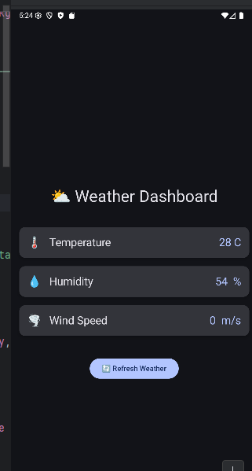

# Weather Dashboard

## Описание
Приложение «Weather Dashboard» демонстрирует работу с корутинами в Kotlin для выполнения асинхронных операций без блокировки UI-потока. Имитирует загрузку данных о погоде (температура, влажность, скорость ветра) из «внешних источников» с задержкой и отображает их в удобном интерфейсе.

## Функциональность приложения
- Параллельная загрузка трёх параметров погоды с разным временем ответа
- Отображение индикатора загрузки во время получения данных
- Кнопка обновления (Refresh) для повторной загрузки
- Имитация ошибок сервера и их корректная обработка
- Автоматическое обновление данных каждые 10 секунд
- Расчёт дополнительного индекса погоды с использованием тяжёлых вычислений
- Информация о текущем состоянии загрузки (текстовый прогресс)

## Используемые технологии и библиотеки
- **Kotlin** — основной язык разработки
- **Jetpack Compose** — декларативный UI-фреймворк
- **Coroutines** (`kotlinx-coroutines-core`, `kotlinx-coroutines-android`)
- **ViewModel + StateFlow** — управление состоянием экрана
- **Dispatchers.Main / IO / Default** — распределение задач по потокам
- **Navigation Compose** — не используется (одноэкранный проект)
- **Android Studio** — среда разработки

## Ответы на контрольные вопросы

### A) В чём разница между launch и async?
- **`launch`** запускает корутину «и забывает» — ничего не возвращает (возвращает `Job`). Используется, когда результат не нужен (например, отправка логов).
- **`async`** запускает корутину и возвращает `Deferred<T>`, из которого можно получить результат через `.await()`. Используется, когда результат важен (например, загрузка данных).

**Пример кода:**
```kotlin
// launch — просто выполняет
viewModelScope.launch {
    saveToDatabase(data)
}

// async — возвращает результат
val weather = viewModelScope.async {
    fetchWeatherFromApi()
}
val result = weather.await() // ждём завершения

```
### B) Что такое suspend функция?

- • **Suspend-функция** — это функция, которая может приостанавливать своё выполнение без блокировки потока.
- • Может вызываться только из другой suspend-функции или корутины.
- × **Нельзя вызывать из обычной (non-suspend) функции** — компилятор выдаст ошибку.  
  *(На самом деле — можно, но только если она помечена `@OptIn(ExperimentalStdlibApi::class)` или используется в `runBlocking`, но в стандартном случае — запрещено)*
- • `delay()` не блокирует поток, потому что это suspend-функция: она «отпускает» поток на время задержки, а после истечения времени возобновляет выполнение корутины.

### C) Зачем нужны разные диспетчеры?

| Диспетчер               | Когда использовать                     | Пример за |
|-------------------------|----------------------------------------|-----------|
| `Dispatchers.Main`      | Обновление UI                          | Изменить текст в `Text()` |
| `Dispatchers.IO`        | Работа с сетью, файлами, БД            | Загрузка JSON с API |
| `Dispatchers.Default`   | Тяжёлые CPU-вычисления                | Сортировка большого списка |

Если выполнить тяжёлое вычисление на `Dispatchers.Main`, UI-поток заблокируется — приложение «зависнет», кнопки не будут реагировать, и система может показать «ANR (Application Not Responding)».

---

### D) Что произойдёт, если не обработать исключение в корутине?

- Если исключение возникает в корутине и **не обработано**, оно **приведёт к крашу приложения** (FATAL EXCEPTION).
- **Корректная обработка**: оборачивать код в `try-catch` внутри корутины.
- **`try-catch` внутри `launch`** нужен, чтобы:
    - Предотвратить падение приложения
    - Показать пользователю понятное сообщение об ошибке
    - Обновить состояние UI (например, скрыть индикатор загрузки)

### E) Как работает автоматическая отмена корутин?

- **`viewModelScope`** — это область (scope) корутин, привязанная к жизненному циклу `ViewModel`.
- Корутины, запущенные в `viewModelScope`, **автоматически отменяются**, когда `ViewModel` уничтожается (например, при выходе пользователя с экрана).
- Это предотвращает утечки памяти и ненужные фоновые операции.

---

## Как запустить проект
1. Откройте проект в Android Studio
2. Подключите устройство или запустите эмулятор
3. Нажмите ▶️ Run 'app'

## Скриншоты работы приложения

- 
- 
- 
- 

## Автор
- **ФИО** - Алексеев Григорий Сергеевич
- **Дата** - 15.02.2026